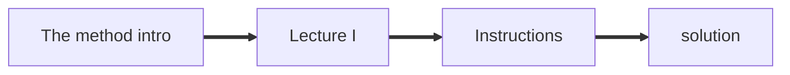

```mermaid
flowchart LR
A[The method intro] ==> B[Lecture I]
B ==> C[Instructions]
C ==> D[solution]
click A "https://pubs.aip.org/aip/jcp/article-abstract/154/17/174108/200045/Multi-replica-biased-sampling-for-photoswitchable?redirectedFrom=fulltext"
click B "Slide.pdf" "The lecture slides"
click C "README.md" "The instructions for the masterclass"
click D "notebook.ipynb" "A python notebook containing an example of calculation of dihedral angle using plumed at different values of lambda"
```