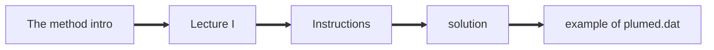

```mermaid
flowchart LR
A[The method intro] ==> B[Lecture I]
B ==> C[Instructions]
C ==> D[solution]
D ==> E[example of plumed.dat]
click A "https://pubs.aip.org/aip/jcp/article-abstract/154/17/174108/200045/Multi-replica-biased-sampling-for-photoswitchable?redirectedFrom=fulltext"
click B "https://static1.squarespace.com/static/5fe9a1f019bc26003ee2f585/t/66bf0a3059d1da25c8693695/1723796018487/Slide.pdf" "The lecture slides"
click C "https://github.com/adpietropaolo/tutorial/blob/main/README.md" "The instructions for the masterclass"
click D "https://github.com/adpietropaolo/tutorial/blob/main/notebook.ipynb" "A python notebook containing an example of calculation of dihedral angle using plumed at different values of lambda"
click E "https://github.com/adpietropaolo/tutorial/blob/main/plumed.dat" "An example of plumed.dat file that contains the definition of dihedrals, the functions of the torsional potentials in each electronic states, the value of lambda of the FEP simulations, the parallel bias metadynamics parameters"
```