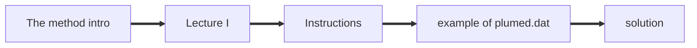

```mermaid
flowchart LR
A[The method intro] ==> B[Lecture I]
B ==> C[Instructions]
C ==> D[example of plumed.dat]
D ==> E[solution]
click A "mypaper" "The paper related to the Multi-replica biased sampling for Trans-cis isomerization in the ground and excited states using PLUMED"
click B "Slide.pdf" "The lecture slides"
click C "README.md" "The instructions for the masterclass"
click D "plumedfile.dat" "The example plumed input file"
click E "notebook.ipynb" "The notebook file"
```